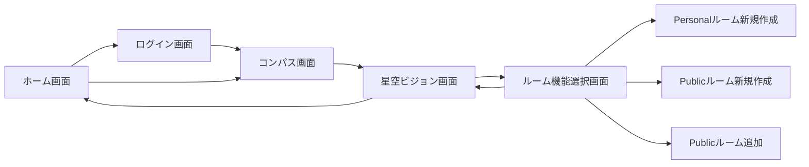

# 星空ビジョン ver tablet
## 星空ビジョンを引き継ぐ6代目へ
星空ビジョンは加藤研究室で２００９年から始まったプロジェクトです。
星空に落書きができて、いろんな場所にいる人同士でコミュニケーションできたら面白いなという研究です。
現在は5代目のため、次に始める方は6代目になります。
4代目までの星空ビジョンはPC端末を実行環境として想定していたため、開発言語はC#フォームで開発されていました。
5代目では
- モバイル端末を用いて、現実の星を観察しながら活用できるコミュニケーションツール
- VR端末を用いて、仮想空間上の星に対して身体動作を反映させるコミュニケーションツール

を開発しました。

卒業した先輩の引き継ぎをする際に困るポイント第１位は

「他人が書いたコードなんて読めん」

に尽きると思います。
研究を引き継ぐ上での検討材料にしていただけたらと思います。
研究頑張ってください！応援しています！

## 開発環境
Mac OS必須
- Xcode
- Swift
- Firebase (realtime databese)
## 実行環境
- iPhone or iPad

## 必要なもの
- タブレット端末
- Apple開発用アカウント

## 事前知識
- 恒星に関する天体位置計算手法
- 緯度経度と星の位置
- 回転の幾何学知識（Quaternion）
- お絵かきソフトの構造

- オブジェクト指向（クラスの概念、デリゲート）
- Firebaseのデータベースの考え方

## 機能設計
- 天体表示機能
- 拡大縮小機能
- 固定機能
- 手書きアノテーショ機能
- キャリブレーション機能
- ログイン機能
- ルーム機能

##  画面設計

## 投稿学会

学会発表は学部では論文を避けていたため、主に大学院で発表したものしかありません。それぞれ区分け以下のようになっています。
| 学会名 | システム | Link |
| :----: | :----: | :----: |
|サイバーコロキウム|タブレット版|[PDF](https://blog.bmoon.jp/papers/yuichihasu202010a.pdf)|
|CE研|タブレット版とVR版|[PDF](https://blog.bmoon.jp/papers/yuichihasu202111a.pdf)|
|インタラクション|VR版|---|

プログラムのリンクはこちらになります。

[ヒューマンインタフェース学会ヒューマンインタフェースサイバーコロキウム 1D2](https://jp.his.gr.jp/events/hic2/hic2-program/)

[情報処理学会コンピュータと教育研究会162回研究発表会 18](https://ce.eplang.jp/index.php?162%B2%F3%B8%A6%B5%E6%C8%AF%C9%BD%B2%F1)

[第26回情報処理学会シンポジウムインタラクション2022　２D-08](https://www.interaction-ipsj.org/2022/program/)

