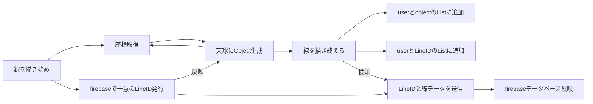

# 手書きアノテーション機能

### 手書きアノテーションの概要
星空ビジョンのメインの機能です。
ここではシステムの設計上の構造等を説明するため、自分自身が描く手書きアノテーション機能と他の人が描く手書きアノテーションの共有を含めて説明します。

### 手書きアノテーション機能を設計する際に考慮したポイント
- 設置した天球の内側からの衝突判定を可能にする
- ３次元の座標系を設置した球面のローカル座標系で管理する
- Undo Redoのために書いた線をListで保持する
- 線のレイヤーをユーザごとに分ける
- 通信で反映させた線をその時に描いた線を分ける

# ユーザが線を描いたときのの処理の流れ

通常、Firebaseのデータベースだけで管理することが一般的だが、Firebaseのデータベースとは別にユーザ側でもListで管理している。
本来であればMVCモデルにしたがってユーザ側がデータを保持する必要はないが、リアルタイムに線を描いたり消したりするため、遅延処理は好ましくない。
そのため、ユーザのリアルタイムの処理と通信のリアルタイムの処理を分離するためこのような設計になった。

# 他の人が線を描いたときの反映

